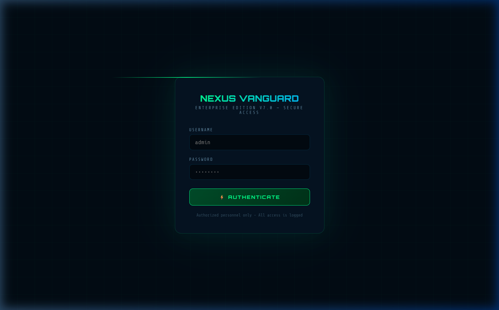
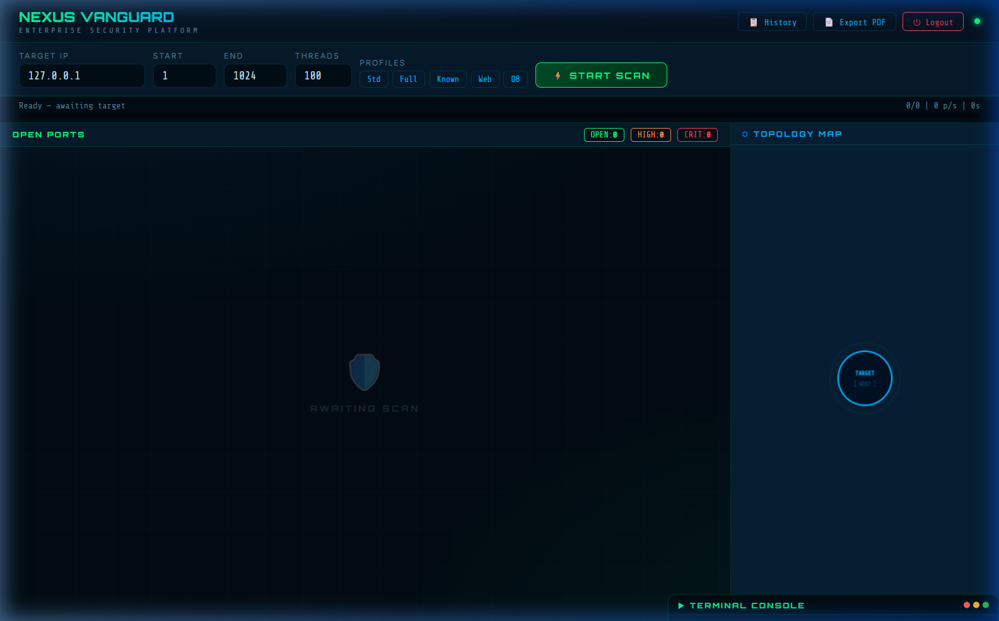
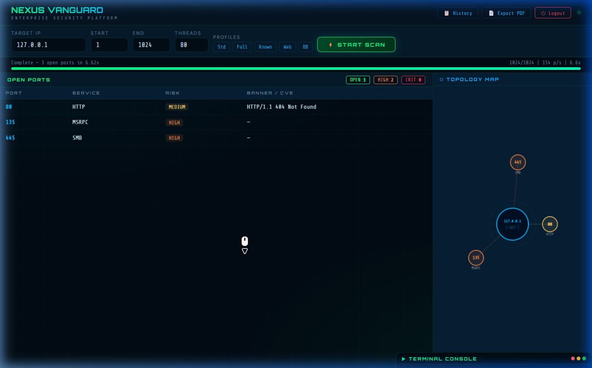
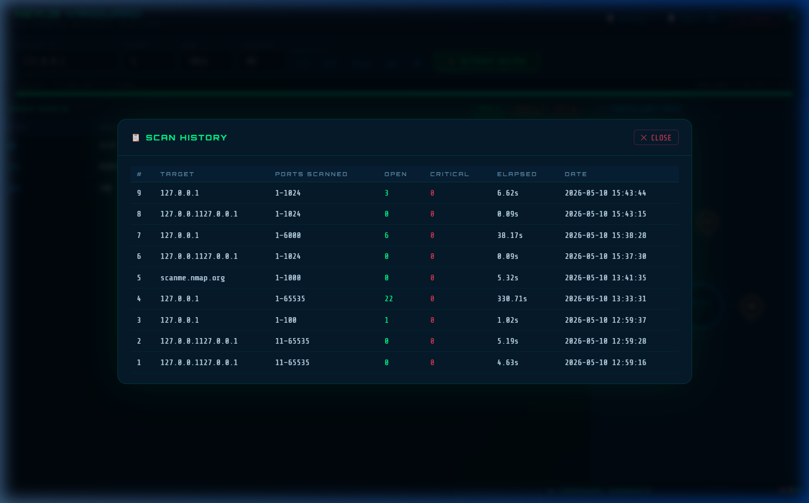

<div align="center">


<br/>


<br/><br/>

[](https://python.org)
[](https://flask.palletsprojects.com)
[](https://socket.io)
[](https://docker.com)
[](https://sqlite.org)
[](https://github.com/ziyaguner/nexus-vanguard/actions)
[](LICENSE)

<br/>


</div>

---

## 💀 Bu ne?

> *Bir ağa baktığında ne görüyorsun? Sadece bir IP mi?*
> *Nexus Vanguard ise her açık portu, her servisi, her CVE'yi görür.*

**Nexus Vanguard**, Python + Flask + WebSocket üzerine inşa edilmiş, gerçek zamanlı ağ güvenlik tarama platformudur. Sıradan bir port scanner değil — **cyberpunk dashboard**, **25 CVE imzası**, **Canvas topoloji haritası** ve **PDF rapor** özelliğiyle kurumsal düzeyde bir güvenlik aracı.

```
🎯 Hedef IP gir  →  ⚡ 100 thread başlat  →  🔍 Portları tara  →  💀 CVE eşleştir  →  📄 Rapor al
```

---

## 📸 Ekran Görüntüleri

### 🔐 Giriş Ekranı
<div align="center">

</div>

<br/>

### 🖥️ Ana Dashboard (Boş — Tarama Bekliyor)
<div align="center">

</div>

<br/>

### ⚡ Tarama Sonuçları + Canvas Topoloji Haritası
*3 açık port tespit edildi: HTTP (80), MSRPC (135), SMB (445)*
<div align="center">

</div>

<br/>

### 🖥️ Terminal Konsolu — Canlı Tarama Logları
<div align="center">

</div>

<br/>

### 📋 Tarama Geçmişi
<div align="center">

</div>

---

## ✨ Özellikler

<table>
<tr>
<td width="50%">

### ⚡ Gerçek Zamanlı Tarama
- **WebSocket akışı** — Her açık port sayfa yenilenmeden anında gelir
- **100 eşzamanlı thread** — Yüksek hızlı port tarama motoru
- **Banner yakalama** — Servis versiyonu otomatik tespit edilir
- **5 hazır profil** — Std / Full / Known / Web / DB

</td>
<td width="50%">

### 💀 Güvenlik & CVE Analizi
- **25 CVE imzası** — Heartbleed, EternalBlue, Log4Shell ve daha fazlası
- **Otomatik risk sınıflandırması** — `CRITICAL` / `HIGH` / `MEDIUM` / `LOW`
- **Flask-Login kimlik doğrulama** — Yetkisiz erişim tamamen engellenir
- **SQLite geçmişi** — Her tarama kalıcı olarak kaydedilir

</td>
</tr>
<tr>
<td width="50%">

### 🗺️ Görselleştirme
- **Canvas topoloji haritası** — Canlı ağ grafı, portlar düğüm olarak çizilir
- **Hacker terminali** — Gerçek zamanlı log konsolu
- **CRITICAL nabız animasyonu** — Yüksek riskli portlar kırmızı yanar
- **PDF rapor** — Tek tıkla kurumsal çıktı al

</td>
<td width="50%">

### 🐳 DevOps Hazır
- **Docker & Compose** — Tek komutla ayağa kalkar
- **Kalıcı volume** — Veritabanı konteyner silinse de korunur
- **GitHub Actions CI/CD** — Her push'ta otomatik lint & build
- **REST API** — `/api/history` ile tarama geçmişi JSON

</td>
</tr>
</table>

---

## 🚀 Hızlı Başlangıç

### Python ile (Geliştirme)

```bash
git clone https://github.com/ziyaguner/nexus-vanguard.git
cd nexus-vanguard
pip install -r requirements.txt
python app.py
```

> 🌐 Uygulama açılır: **`http://127.0.0.1:5001`**

### 🐳 Docker ile (Üretim)

```bash
docker-compose up -d        # Başlat (arka planda)
docker-compose logs -f      # Logları izle
docker-compose down         # Durdur
```

---

## 🔑 Giriş Bilgileri

> [!WARNING]
> Aşağıdaki varsayılan bilgileri halka açık bir sunucuya deploy etmeden önce `app.py` içinde değiştirin!

| Alan | Değer |
|:---:|:---:|
| Kullanıcı Adı | `admin` |
| Şifre | `nexus2026` |

---

## 🕹️ Nasıl Kullanılır?

> [!TIP]
> Kendi sisteminizi taramak için `127.0.0.1` girin. Ağ cihazları için yerel IP adresini kullanın.

**1.** Giriş yapın &nbsp;**→**&nbsp; **2.** Hedef IP girin &nbsp;**→**&nbsp; **3.** Profil seçin &nbsp;**→**&nbsp; **4.** `START SCAN` basın &nbsp;**→**&nbsp; **5.** Sonuçları izleyin 🔥

### Tarama Profilleri

| Profil | Port Aralığı | Ne zaman kullanılır? |
|:------:|:------------:|:---------------------|
| `Std` | 1 – 1024 | Günlük kullanım, yaygın servisler (HTTP, SSH, FTP...) |
| `Full` | 1 – 65535 | Kapsamlı tam tarama |
| `Known` | 1 – 1023 | IANA bilinen portlar |
| `Web` | 8000 – 9999 | Web uygulamaları ve API'lar |
| `DB` | 3306 – 3399 | Veritabanı sunucuları |

---

## 💀 CVE Veritabanı — 25 İmza

<details>
<summary><b>🔴 Tüm CVE'leri görmek için tıklayın (25 imza)</b></summary>

<br/>

| CVE | Servis | Ciddiyet | Açıklama |
|-----|--------|:--------:|----------|
| CVE-2014-0160 | OpenSSL 1.0.1 |  | **Heartbleed** — özel anahtar bellek sızıntısı |
| CVE-2017-0144 | SMB v1 |  | **EternalBlue** — WannaCry RCE |
| CVE-2021-44228 | Log4j 2.x |  | **Log4Shell** — JNDI injection RCE |
| CVE-2019-0708 | RDP 3389 |  | **BlueKeep** — kimlik doğrulamasız RCE |
| CVE-2021-41773 | Apache 2.4.49 |  | Dizin geçişi ve Uzaktan Kod Çalıştırma |
| CVE-2021-42013 | Apache 2.4.50 |  | CVE-2021-41773 yaması için RCE atlatma |
| CVE-2017-7494 | Samba 3.5 |  | **EternalRed** — rastgele kütüphane yükleme |
| CVE-2011-2523 | vsftpd 2.3.4 |  | Arka kapı komutu çalıştırma |
| CVE-2020-1938 | Tomcat 9.0.0 |  | **Ghostcat** — AJP rastgele dosya okuma |
| CVE-2019-15846 | Exim 4.87 |  | TLS SNI üzerinden heap taşması RCE |
| CVE-2019-10149 | Exim 4.92 |  | MAIL FROM üzerinden uzaktan komut |
| CVE-2017-7269 | IIS 6.0 |  | WebDAV buffer overflow RCE |
| CVE-2020-7247 | OpenSMTPD 6.6 |  | Root olarak yerel/uzaktan RCE |
| CVE-2018-7600 | Drupal 7 |  | **Drupalgeddon2** kimlik doğrulamasız RCE |
| CVE-2022-0543 | Redis 4.0 |  | Lua sandbox kaçışı RCE |
| CVE-2017-12617 | Tomcat 7.0 |  | JSP yükleme atlatması RCE |
| CVE-2019-11043 | PHP 5.6 |  | FPM yolu alt taşma RCE |
| CVE-2010-4221 | ProFTPD 1.3.3 |  | Telnet IAC heap taşması |
| CVE-2015-3306 | ProFTPD 1.3.5 |  | SITE CPFR ile rastgele dosya kopyalama |
| CVE-2014-6271 | bash 4.3 |  | **Shellshock** — ortam değişkeni RCE |
| CVE-2020-0796 | SMBv3 |  | **SMBGhost** — istemci/sunucu RCE |
| CVE-2016-6515 | OpenSSH 7.2 |  | Sınır tanımayan kimlik doğrulama DoS |
| CVE-2016-2107 | OpenSSL 1.0.2 |  | Dolgu oracle MITM saldırısı |
| CVE-2021-23017 | nginx 1.16.1 |  | DNS çözümleyicide off-by-one heap taşması |
| CVE-2018-15473 | OpenSSH 7.7 |  | Zamanlama farkı ile kullanıcı adı tespiti |

</details>

---

## 🏗️ Mimari

```
┌─────────────────────────────────────────────────────┐
│              Tarayıcı (Socket.IO İstemcisi)          │
│   Login ──► Cyberpunk Dashboard                     │
│               ├── Port Tablosu (canlı WebSocket)    │
│               ├── Canvas Topoloji Haritası           │
│               ├── Hacker Terminal Konsolu            │
│               └── PDF Rapor / Geçmiş Modalı         │
└───────────────────────┬─────────────────────────────┘
                        │  WebSocket (çift yönlü, gerçek zamanlı)
                        ▼
┌─────────────────────────────────────────────────────┐
│           Flask-SocketIO Sunucusu [app.py]           │
│   Flask-Login Auth  │  REST /api/history  │  WS     │
└───────────────────────┬─────────────────────────────┘
                        │  Python callback (on_port, on_progress, on_done)
                        ▼
┌─────────────────────────────────────────────────────┐
│            Tarama Motoru [scanner.py]                │
│   ThreadPoolExecutor (max 100)  │  Banner Yakalama  │
│   CVE Analizi (VULN_DB, 25 imza)                    │
└───────────────────────┬─────────────────────────────┘
                        │  SQLAlchemy ORM
                        ▼
┌─────────────────────────────────────────────────────┐
│             Veritabanı [database.py]                 │
│   ScanRecord + PortRecord ──► SQLite                │
│   (Docker kalıcı volume ile korunur)                │
└─────────────────────────────────────────────────────┘
```

---

## 🛠️ Teknoloji Yığını

<div align="center">

| Katman | Teknoloji |
|:------:|:---------:|
| 🐍 **Backend** | `Python 3.12` · `Flask 3.0` · `Flask-SocketIO` |
| 🔐 **Kimlik Doğrulama** | `Flask-Login` |
| 🗄️ **Veritabanı** | `SQLAlchemy` · `SQLite` |
| ⚡ **Gerçek Zamanlı** | `Socket.IO` · `WebSocket` |
| 🎨 **Frontend** | `HTML5` · `CSS3` · `JavaScript ES6+` |
| 🗺️ **Görselleştirme** | `HTML5 Canvas` |
| 📄 **PDF** | `jsPDF` · `autoTable` |
| 🐳 **Konteyner** | `Docker` · `Docker Compose` |
| 🔄 **CI/CD** | `GitHub Actions` |

</div>

---

## 📁 Proje Yapısı

```
nexus-vanguard/
│
├── 🐍 app.py                    # Sunucu, kimlik doğrulama, REST API, WS event'leri
├── 🔍 scanner.py                # Tarama motoru + 25 CVE imzası
├── 🗄️  database.py               # SQLAlchemy modelleri (ScanRecord, PortRecord)
├── 📋 requirements.txt
├── 🐳 Dockerfile
├── 🐳 docker-compose.yml
│
├── 📁 templates/
│   ├── index.html               # Cyberpunk ana dashboard
│   └── login.html               # Giriş ekranı
│
├── 📁 assets/                   # Ekran görüntüleri
│
└── 📁 .github/workflows/
    └── docker-build.yml         # CI/CD: lint + Docker build
```

---

## ⚙️ Yapılandırma

```python
# app.py — Temel ayarlar
ADMIN_USER = "admin"       # Kullanıcı adı
ADMIN_PASS = "nexus2026"   # Şifre — deploy öncesi değiştir!
PORT       = 5001          # Sunucu portu
```

```python
# scanner.py — Tarama ayarları
TIMEOUT = 0.5    # Port başına soket zaman aşımı (saniye)
MAX_WORKERS = 100  # Maksimum eşzamanlı thread
```

---

## 🔄 CI/CD Pipeline

> [!NOTE]
> Her `main` branch push'unda aşağıdaki adımlar otomatik çalışır.

```
git push
  └─► [1] Python Lint (flake8)
  └─► [2] Docker Build + Container Test
```

---

## ⚠️ Yasal Uyarı

> [!CAUTION]
> **Bu araç yalnızca eğitim ve etik güvenlik testleri amacıyla geliştirilmiştir.**
>
> - Yalnızca **kendi sisteminizi** veya **yazılı izin aldığınız** ağ ve cihazları tarayabilirsiniz.
> - Yetkisiz port taraması, **Türk Ceza Kanunu** ve pek çok ülkenin bilişim mevzuatı kapsamında **suçtur**.
> - Bu yazılımı kullananlar, tüm hukuki sorumluluğu **tamamen kendileri kabul etmiş** sayılır.
> - Geliştiriciler, yazılımın amaç dışı veya yetkisiz kullanımından doğan hiçbir zarardan sorumlu tutulamaz.

---

<div align="center">

<br/>

*Güvenlik topluluğu için tutkuyla geliştirildi* 🔐

[](https://github.com/ziyaguner/nexus-vanguard/stargazers)
[](https://github.com/ziyaguner/nexus-vanguard/network/members)

<br/>


</div>
