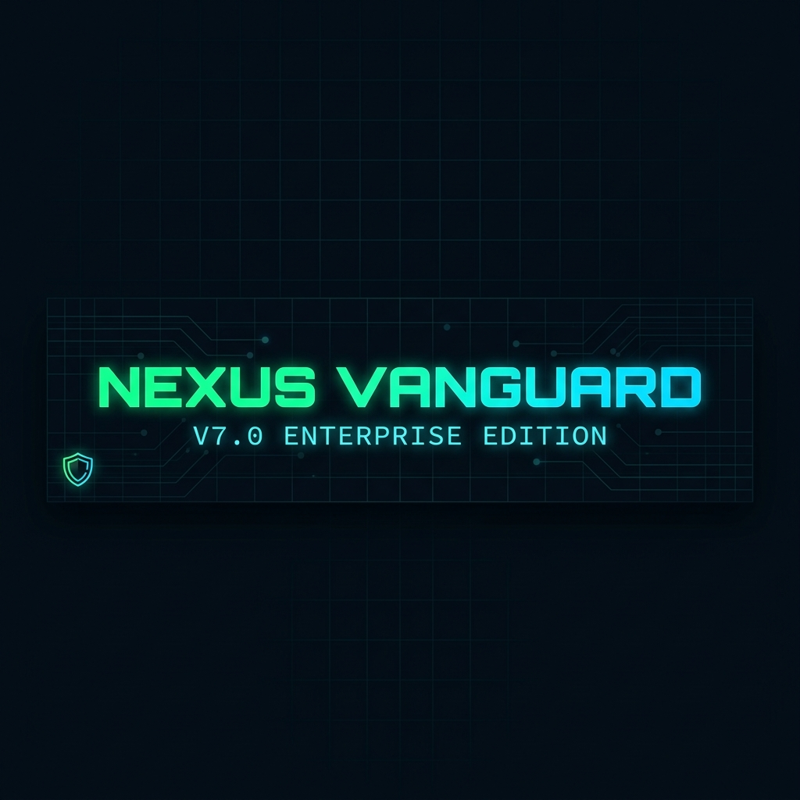

  

 

 

> **Gercek zamanli WebSocket akisi · 25 CVE imzasi · Canvas topoloji haritasi · Kalici tarama gecmisi · PDF rapor · Docker hazir**

 

---

## Ozellikler

| Ozellik | Aciklama |
|---|---|
| **Gercek Zamanli WebSocket** | Her acik port, sayfa yenilenmeden aninda Socket.IO ile arayuze iletilir |
| **Guvenli Kimlik Dogrulama** | Flask-Login ile korunan giris ekrani - yetkisiz erisim tamamen engellenir |
| **Otomatik CVE Tespiti** | 25+ bilinen zafiyetli surum imzasi canli banner verisiyle eslestirilerek analiz edilir |
| **Etkilesimli Topoloji Haritasi** | Merkez hedef dugumu ve uydu port dugumlerindan olusan canli Canvas ag grafigi |
| **Kalici Tarama Gecmisi** | Her tamamlanan tarama SQLAlchemy ile SQLite'a kaydedilir, gecmis panelinden goruntulenir |
| **Terminal Konsolu** | Sag altta acilip kapanan, gercek zamanli log akisi gosteren hacker tarzinda terminal |
| **PDF Rapor Disa Aktarma** | jsPDF ve autoTable ile tek tikta kurumsal rapor indirme |
| **Siber Guvenlik Arayuzu** | Neon vurgulu karanlik tema, CRITICAL nabiz animasyonu, canli ilerleme cubugu |
| **Docker Destegi** | Windows, Linux ve macOS'ta tek komutla calistirma, kalici volume destegiyle |
| **CI/CD Pipeline** | GitHub Actions: flake8 kod denetimi, black format kontrolu, Docker build dogrulamasi |

---

## Hizli Baslangic

### Yontem 1 - Python ile (Gelistirme icin onerilir)

`ash
# 1. Depoyu klonla
git clone https://github.com/kullanici-adin/nexus-vanguard.git
cd nexus-vanguard

# 2. Bagimliliklari yukle
pip install -r requirements.txt

# 3. Calistir
python app.py
`

Tarayici otomatik acilir -> **http://127.0.0.1:5001**

### Yontem 2 - Docker ile (Uretim icin onerilir)

`ash
# Derle ve baslat
docker-compose up -d

# Loglari izle
docker-compose logs -f

# Durdur
docker-compose down
`

Tarayicide ac -> **http://localhost:5001**

---

## Varsayilan Giris Bilgileri

| Alan | Deger |
|---|---|
| Kullanici Adi | dmin |
| Sifre | 
exus2026 |

> Halka acik bir sunucuya deploy etmeden once pp.py icindeki ADMIN_PASS degerini degistirin.

---

## Nasil Kullanilir?

1. Yukaridaki bilgilerle **giris yapin**
2. Hedef bir **IP adresi** girin (ornegin 192.168.1.1 veya 127.0.0.1)
3. Port araligini ayarlayin ya da hazir bir profil secin:

| Profil | Aralik | Kullanim Amaci |
|---|---|---|
| Std | 1 - 1024 | Yaygin servisler |
| Full | 1 - 65535 | Tam tarama |
| Known | 1 - 1023 | IANA bilinen portlar |
| Web | 8000 - 9999 | Web uygulamalari ve API'lar |
| DB | 3306 - 3399 | Veritabani sunuculari |

4. **TARAMAYI BASLAT** butonuna basin - sonuclar tabloda aninda gorunur
5. **CRITICAL** riskli satirlar kirmizi nabiz efektiyle yanar (CVE tespit edildi)
6. **Gecmis** butonuyla tum eski taramalari goruntuleyin
7. Tarama bittikten sonra **PDF Indir** ile kurumsal rapor alin
8. Sag alttaki **TERMINAL KONSOLU** ile canli log akisini izleyin

---

## Yerlesik CVE Veritabani (25 Imza)

| CVE | Servis | Ciddiyet | Aciklama |
|---|---|---|---|
| CVE-2014-0160 | OpenSSL 1.0.1 | KRITIK | Heartbleed - ozel anahtar bellek sizintisi |
| CVE-2021-41773 | Apache 2.4.49 | KRITIK | Dizin gecisi ve Uzaktan Kod Calistirma (RCE) |
| CVE-2021-42013 | Apache 2.4.50 | KRITIK | CVE-2021-41773 yamasi icin RCE atlatma |
| CVE-2017-7494 | Samba 3.5 | KRITIK | EternalRed - rastgele kutuphane yukleme RCE |
| CVE-2011-2523 | vsftpd 2.3.4 | KRITIK | Arka kapi komutu calistirma |
| CVE-2020-1938 | Tomcat 9.0.0 | KRITIK | Ghostcat - AJP rastgele dosya okuma |
| CVE-2019-15846 | Exim 4.87 | KRITIK | TLS SNI uzerinden heap tasmasi RCE |
| CVE-2019-10149 | Exim 4.92 | KRITIK | MAIL FROM uzerinden uzaktan komut calistirma |
| CVE-2017-7269 | IIS 6.0 | KRITIK | WebDAV buffer overflow RCE |
| CVE-2020-7247 | OpenSMTPD 6.6 | KRITIK | Root olarak yerel/uzaktan RCE |
| CVE-2018-7600 | Drupal 7 | KRITIK | Drupalgeddon2 - kimlik dogrulamasiz RCE |
| CVE-2022-0543 | Redis 4.0 | KRITIK | Lua sandbox kacisi RCE |
| CVE-2017-12617 | Tomcat 7.0 | KRITIK | JSP yukleme atlatmasi RCE |
| CVE-2019-11043 | PHP 5.6 | KRITIK | FPM yolu alt tasma RCE |
| CVE-2010-4221 | ProFTPD 1.3.3 | KRITIK | Telnet IAC heap tasmasi |
| CVE-2015-3306 | ProFTPD 1.3.5 | KRITIK | SITE CPFR ile rastgele dosya kopyalama |
| CVE-2016-6515 | OpenSSH 7.2 | YUKSEK | Sinir tanimayan kimlik dogrulama dongusuyle DoS |
| CVE-2018-15473 | OpenSSH 7.7 | ORTA | Zamanlama farki ile kullanici adi tespiti |
| CVE-2016-2107 | OpenSSL 1.0.2 | YUKSEK | Dolgu oracle MITM saldirisi |
| CVE-2021-23017 | nginx 1.16.1 | YUKSEK | DNS cozumleyicide off-by-one heap tasmasi |

*...ve 5 imza daha yerlesik olarak mevcuttur.*

---

## Mimari

`
Tarayici (Socket.IO Istemcisi)
  Giris -> Panel -> Tablo + Canvas + Terminal + PDF Disa Aktarma
         |
         |  WebSocket (cift yonlu, gercek zamanli)
         v
Flask-SocketIO Sunucusu (app.py)
  Flask-Login Kimlik Dogrulama | REST /api/history | WebSocket Olaylari
         |
         |  Python geri cagrima fonksiyonlari (on_port, on_progress, on_done)
         v
Tarama Motoru (scanner.py)
  ThreadPoolExecutor (maks. 100 is parcacigi) | Banner Yakalama
  CVE Guvenlik Acigi Analizi (VULN_DB, 25 imza)
         |
         |  SQLAlchemy ORM
         v
Veritabani Katmani (database.py)
  ScanRecord + PortRecord | SQLite (Docker kalici volume)
`

---

## Proje Yapisi

`
nexus-vanguard/
|-- app.py                        # Flask-SocketIO sunucusu, kimlik dogrulama, REST API
|-- scanner.py                    # Tarama motoru, CVE veritabani, banner yakalama
|-- database.py                   # SQLAlchemy modelleri ve CRUD islemleri
|-- requirements.txt              # Python bagimliliklari
|-- Dockerfile                    # Konteyner imaji tanimi
|-- docker-compose.yml            # Orkestrasyon + kalici volume
|-- templates/
|   |-- index.html                # Tam kapsamli siber guvenlik paneli
|   -- login.html                # Guvenli giris sayfasi
-- .github/
    -- workflows/
        -- docker-build.yml      # CI/CD pipeline
`

---

## Teknoloji Yigini

| Katman | Teknoloji |
|---|---|
| Backend | Python 3.12, Flask 3.0, Flask-SocketIO |
| Kimlik Dogrulama | Flask-Login (oturum tabanli) |
| Veritabani | SQLAlchemy + SQLite |
| Gercek Zamanli Iletisim | Socket.IO (WebSocket + uzun yoklama yedegi) |
| Frontend | Vanilla HTML5, CSS3, JavaScript ES6+ |
| Gorsellestirme | HTML5 Canvas (ozel topoloji grafigi) |
| PDF Olusturma | jsPDF + jsPDF-AutoTable |
| Konteynerlestirme | Docker, Docker Compose |
| CI/CD | GitHub Actions (flake8, black, Docker build) |

---

## Yapilandirma

pp.py icindeki temel ayarlar:

`python
ADMIN_USER = "admin"       # Giris kullanici adi
ADMIN_PASS = "nexus2026"   # Giris sifresi - Deploy oncesi mutlaka degistirin!
PORT       = 5001          # Web sunucusu portu
`

scanner.py icindeki temel ayarlar:

`python
TIMEOUT = 0.5    # Port basina soket zaman asimi (saniye)
# Is parcacigi sayisi scan_range() icinde maks. 100 ile sinirlandirilmistir
`

---

## CI/CD Pipeline

main veya master branch'ine her push'ta:

1. **Python Kod Denetimi** - flake8 ile sozdizimi ve stil hatasi kontrolu (maks. satir uzunlugu: 120)
2. **Format Kontrolu** - black ile tutarli kod formati dogrulamasi
3. **Docker Build** - Imaj derlenir, konteynerin saglikli basladigi dogrulanir

---

## Yasal Uyari

> Bu arac yalnizca **yetkili guvenlik testleri ve egitim amacli kullanim** icin tasarlanmistir.
> Yalnizca kendi sahibi oldugunuz veya yazili izin aldiginiz ag ve sistemleri tarayin.
> Yetkisiz port taramasi yasandiginiz ulkede yasal suctur.
> Yazarlar, aracin kotye kullanimi nedeniyle hicbir sorumluluk kabul etmez.

---

## Lisans

MIT Lisansi - (c) 2026 Nexus Vanguard Systems

---

Guvenlik toplulugu icin tutkuyla gelistirildi.

*Projeyi faydali bulduysaniz yildiz vermeyi unutmayin!*

